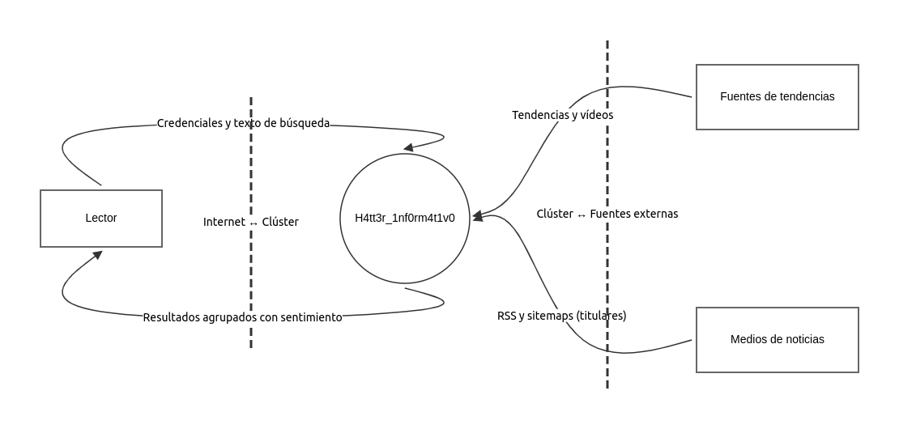
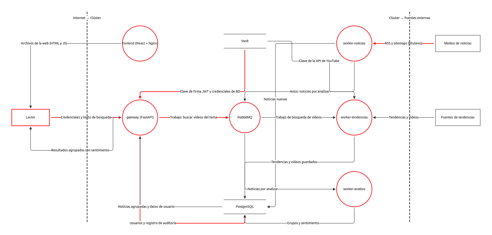

# Modelo de amenazas: H4tt3r_1nf0rm4t1v0

## Estado y alcance

| Campo | Valor |
|---|---|
| Fase | E1, Requisitos y diseño seguro |
| Issue | #18 |
| Fecha | 2026-09-29 |
| Versión | 1 |
| Propietario | H4TT3R_XPLO1T |
| Archivo fuente | [`architecture/threat-model.json`](architecture/threat-model.json) (OWASP Threat Dragon 2.6.2) |

El modelo cubre el **diseño**: todavía no existe código. Se revisará en E3 (cuando haya servicios reales) y cada vez que cambie la arquitectura. Guía para reproducirlo: [`architecture/guia-threat-dragon.md`](architecture/guia-threat-dragon.md).

## Metodología

Se dibujan un DFD (diagrama de flujo de datos) de nivel 0 (el sistema como una caja) y otro de nivel 1 (los servicios internos), y se aplica **STRIDE por elemento y por flujo**. Sin este ejercicio, los controles se elegirían por costumbre y no por las amenazas reales del diseño.

| Letra | Categoría | Pregunta que responde |
|---|---|---|
| S | Suplantación (Spoofing) | ¿Alguien puede hacerse pasar por otro usuario o componente? |
| T | Manipulación (Tampering) | ¿Alguien puede alterar datos o código sin permiso? |
| R | Repudiación (Repudiation) | ¿Alguien puede negar una acción sin que se pueda demostrar lo contrario? |
| I | Divulgación de información (Information disclosure) | ¿Se pueden leer datos que no deberían? |
| D | Denegación de servicio (Denial of service) | ¿Se puede impedir que el sistema responda? |
| E | Elevación de privilegios (Elevation of privilege) | ¿Se puede obtener más permisos de los asignados? |

Las amenazas se concentran donde los flujos cruzan un **límite de confianza** (la línea que separa zonas con distinto nivel de control), porque ahí los datos pasan de un dominio a otro y hay que validarlos.

## Supuestos

- El clúster es K3s local, ejecutado con k3d (ADR 0003 y ficha del proyecto).
- Solo `worker-noticias` y `worker-tendencias` tienen salida a internet, y solo hacia una lista fija de dominios mediante un proxy de salida (las NetworkPolicy nativas filtran por IP, no por dominio; ver amenaza 21). El gateway y `worker-analisis` no tienen salida.
- Se descargan solo feeds y sitemaps; los artículos no se descargan: se guardan titular, enlace, fecha y resumen del propio feed.
- El modelo cubre **solo la aplicación**. La cadena de suministro de CI/CD (GitHub Actions, Docker Hub, dependencias del pipeline) **no está modelada**: tendrá su propia sección en E4/E7. Es una brecha declarada, no un olvido.
- Los flujos internos del clúster están marcados como no cifrados a propósito, para que la brecha siga visible hasta decidir el cifrado interno (ver «Decisiones pendientes»).

## DFD nivel 0

El nivel 0 muestra el sistema completo como un único proceso y sus interacciones con el exterior.

| Elemento | Tipo | Descripción |
|---|---|---|
| H4tt3r_1nf0rm4t1v0 | Proceso | Sistema completo: frontend, gateway, workers, RabbitMQ, PostgreSQL y Vault en un clúster K3s local (k3d). |
| Lector | Actor | Persona que usa la aplicación desde el navegador. |
| Medios de noticias | Actor | RCN y Semana (RSS); Caracol, Blu Radio y Citytv (sitemaps). |
| Fuentes de tendencias | Actor | YouTube Data API, Google Trends (RSS) y Mastodon (solo etiquetas y enlaces). |

| Flujo (origen → destino) | Nombre | Protocolo | Cifrado | Red pública |
|---|---|---|---|---|
| Lector → H4tt3r_1nf0rm4t1v0 | Credenciales y texto de búsqueda | HTTPS | Sí | Sí |
| Medios de noticias → H4tt3r_1nf0rm4t1v0 | RSS y sitemaps (titulares) | HTTPS | Sí | Sí |
| H4tt3r_1nf0rm4t1v0 → Lector | Resultados agrupados con sentimiento | HTTPS | Sí | Sí |
| Fuentes de tendencias → H4tt3r_1nf0rm4t1v0 | Tendencias y vídeos | HTTPS | Sí | Sí |

Límites de confianza: «Internet ↔ Clúster»; «Clúster ↔ Fuentes externas».

## DFD nivel 1

Elementos (11):

| Elemento | Tipo | Descripción |
|---|---|---|
| Lector | Actor | Persona que usa la aplicación desde el navegador. |
| gateway (FastAPI) | Proceso | Única API pública: autenticación JWT con roles, búsqueda, auditoría y límite de peticiones. Sin salida a internet. |
| RabbitMQ | Proceso | Cola de trabajos entre el gateway y los workers. |
| worker-noticias | Proceso | Lee RSS y sitemaps de los 5 medios (lista fija de dominios). |
| worker-tendencias | Proceso | Consulta YouTube, Google Trends y Mastodon (lista fija de dominios). |
| frontend (React + Nginx) | Proceso | SPA estática servida por Nginx. Sin lógica de negocio ni secretos. |
| worker-analisis | Proceso | Agrupa noticias de distintos medios y calcula el sentimiento (pysentimiento, sin salida a internet). |
| PostgreSQL | Almacén | Usuarios, noticias, grupos, sentimiento y auditoría. |
| Vault | Almacén | Clave de la API de YouTube, credenciales de la base de datos y clave de firma de los JWT. |
| Medios de noticias | Actor | RCN y Semana (RSS); Caracol, Blu Radio y Citytv (sitemaps). |
| Fuentes de tendencias | Actor | YouTube Data API, Google Trends (RSS) y Mastodon (solo etiquetas y enlaces). |

Flujos (16). Cada flecha apunta en la dirección en que se mueven los **datos**, no la de la petición.

| Flujo (origen → destino) | Nombre | Protocolo | Cifrado | Red pública |
|---|---|---|---|---|
| frontend (React + Nginx) → Lector | Archivos de la web (HTML y JS) | HTTPS | Sí | Sí |
| Lector → gateway (FastAPI) | Credenciales y texto de búsqueda | HTTPS | Sí | Sí |
| gateway (FastAPI) → Lector | Resultados agrupados con sentimiento | HTTPS | Sí | Sí |
| gateway (FastAPI) → PostgreSQL | Usuarios y registro de auditoría | PostgreSQL | No | No |
| PostgreSQL → gateway (FastAPI) | Noticias agrupadas y datos de usuario | PostgreSQL | No | No |
| Vault → gateway (FastAPI) | Clave de firma JWT y credenciales de BD | HTTP (API de Vault) | No | No |
| gateway (FastAPI) → RabbitMQ | Trabajo: buscar vídeos del tema | AMQP | No | No |
| Medios de noticias → worker-noticias | RSS y sitemaps (titulares) | HTTPS | Sí | Sí |
| worker-noticias → PostgreSQL | Noticias nuevas | PostgreSQL | No | No |
| worker-noticias → RabbitMQ | Aviso: noticias por analizar | AMQP | No | No |
| RabbitMQ → worker-analisis | Noticias por analizar | AMQP | No | No |
| worker-analisis → PostgreSQL | Grupos y sentimiento | PostgreSQL | No | No |
| RabbitMQ → worker-tendencias | Trabajo de búsqueda de vídeos | AMQP | No | No |
| Fuentes de tendencias → worker-tendencias | Tendencias y vídeos | HTTPS | Sí | Sí |
| worker-tendencias → PostgreSQL | Tendencias y vídeos guardados | PostgreSQL | No | No |
| Vault → worker-tendencias | Clave de la API de YouTube | HTTP (API de Vault) | No | No |

Límites de confianza: «Internet ↔ Clúster»; «Clúster ↔ Fuentes externas».

Simplificación: los workers también leen sus credenciales de base de datos desde Vault; esos flujos se omiten del diagrama para mantenerlo legible.

## Amenazas STRIDE

Total: 47 amenazas, todas en estado **Abierta** (aún no hay código ni pruebas que demuestren los controles).

| Categoría STRIDE | Amenazas |
|---|---|
| Suplantación (S) | 8 |
| Manipulación (T) | 11 |
| Repudiación (R) | 2 |
| Divulgación de información (I) | 11 |
| Denegación de servicio (D) | 8 |
| Elevación de privilegios (E) | 7 |

| Severidad | Amenazas |
|---|---|
| Alta | 20 |
| Media | 24 |
| Baja | 3 |

Criterio de clasificación: el XXE (20) se clasifica como Manipulación porque la entrada manipulada altera el procesamiento del worker, aunque su efecto puede ser divulgación o denegación de servicio; el SSRF (21) y la deserialización insegura (33) como Elevación de privilegios, porque el atacante usa la identidad y el acceso de red del servicio para llegar donde él no puede.

| # | Elemento o flujo | Categoría | Severidad | Título | Control | Verificación | Estado |
|---|---|---|---|---|---|---|---|
| 1 | gateway (FastAPI) | Suplantación (S) | Alta | Suplantación de usuario con un JWT robado o falsificado | JWT HS256 firmado con una clave aleatoria de al menos 256 bits guardada en Vault; algoritmo fijado (algorithms=["HS256"], se rechaza "none"); validación de exp, iss y aud en cada petición; kid para rotar la clave; token en cookie __Host- con HttpOnly, Secure y SameSite=Strict; vida de 15 minutos (ADR 0004). | pruebas con token caducado, alterado, con alg=none y con otra audiencia; escaneo con ZAP. | Abierta |
| 2 | gateway (FastAPI) | Elevación de privilegios (E) | Media | Elevación de privilegios por concentración de funciones en el gateway | Cuatro roles (lector, editor, auditor, administrador) con denegación por defecto en cada endpoint; el administrador no puede ser auditor, ni asignarse ese rol, ni leer o borrar la auditoría; el rol va en el JWT firmado y se revalida en BD para acciones sensibles; contenedor sin root; sin salida a internet (NetworkPolicy). Si la auditoría crece, separarla en su propio servicio (ADR 0003 y 0004). | pruebas de autorización por rol (cada rol recibe 403 fuera de sus permisos, incluida la auditoría para el administrador). | Abierta |
| 3 | Lector | Suplantación (S) | Media | Registro masivo de cuentas falsas | Límite de registros por IP y por intervalo; política de contraseñas según OWASP ASVS; el límite de búsquedas se aplica también por IP. | prueba de registros repetidos que devuelven 429. | Abierta |
| 4 | Lector | Repudiación (R) | Baja | El lector niega haber realizado una búsqueda o acción | Registro de auditoría de cada búsqueda con UUID del usuario, fecha, acción, resultado, número de resultados e IP acortada; no se guarda el texto de búsqueda; retención de 180 días con un rol de purga propio (ADR 0004). | prueba unitaria que comprueba el registro tras cada búsqueda y que el texto buscado no aparece en él. | Abierta |
| 5 | frontend (React + Nginx) | Manipulación (T) | Alta | XSS con contenido de los medios o del usuario | React escapa el contenido por defecto; se prohíbe dangerouslySetInnerHTML; cabecera Content-Security-Policy estricta en Nginx; el token no se guarda en localStorage. | regla de Semgrep y escaneo con ZAP. | Abierta |
| 6 | frontend (React + Nginx) | Manipulación (T) | Media | Imagen o dependencias npm manipuladas | package-lock.json versionado; escaneo con Trivy de dependencias e imagen; imágenes referenciadas por digest (E7). | job de Trivy en CI que falla con CVE críticos. | Abierta |
| 7 | frontend (React + Nginx) | Divulgación de información (I) | Media | Secretos o direcciones internas en el código de la web | El frontend no contiene secretos: solo conoce la URL pública del gateway. | gitleaks en pre-commit y en CI sobre el repositorio y el build. | Abierta |
| 8 | gateway (FastAPI) | Suplantación (S) | Alta | Fuerza bruta o relleno de credenciales en el login | Contraseñas con hash Argon2id (m=19456, t=2, p=1); longitud mínima 15 y máxima de al menos 64, sin reglas de composición y contra una lista local de contraseñas comunes y filtradas; bloqueo progresivo por cuenta (tras 3 fallos, esperas de 1, 5, 15 y 30 minutos) con la recuperación siempre disponible, más límite por IP tomado del Ingress; mensajes genéricos y tiempo constante; MFA TOTP obligatorio en roles con privilegios (ADR 0004). Misma respuesta (401, mismo cuerpo y tiempo similar) para cuenta bloqueada, inexistente o credenciales erróneas; 429 solo para el límite por IP. | prueba de intentos fallidos con esperas crecientes y prueba de respuesta idéntica exista o no el usuario o esté bloqueado. | Abierta |
| 9 | gateway (FastAPI) | Manipulación (T) | Alta | Inyección SQL mediante el texto de búsqueda | Consultas parametrizadas mediante el ORM; validación de longitud y caracteres con Pydantic. | Bandit y Semgrep en CI, pruebas con cargas de inyección y escaneo con ZAP. | Abierta |
| 10 | gateway (FastAPI) | Denegación de servicio (D) | Alta | Abuso de la búsqueda para agotar recursos o la cuota de YouTube | Límite de peticiones por usuario e IP; caché de búsquedas repetidas; tope de trabajos en cola por usuario. | prueba de carga básica y prueba de límite que devuelve 429. | Abierta |
| 11 | gateway (FastAPI) | Repudiación (R) | Media | Acciones administrativas sin trazabilidad | Registro de auditoría de acciones de administración, escrito por el gateway con un rol de solo inserción (ver la amenaza de modificación de la auditoría: protege frente al gateway, no frente al administrador de BD). | prueba que confirma que cada acción de administración deja registro. | Abierta |
| 12 | gateway (FastAPI) | Divulgación de información (I) | Media | Mensajes de error con detalles internos | Errores genéricos hacia el cliente y detalle solo en logs internos; sin modo debug en producción; cabeceras de servidor mínimas. | escaneo con ZAP. | Abierta |
| 13 | Vault | Divulgación de información (I) | Alta | Exposición de secretos por políticas de Vault demasiado amplias | Una política por servicio con mínimo privilegio; autenticación de Kubernetes por cuenta de servicio; tokens de corta duración. | prueba que confirma que cada servicio recibe 403 en los secretos ajenos. | Abierta |
| 14 | Vault | Denegación de servicio (D) | Media | Vault sellado o no disponible impide arrancar los servicios | Procedimiento documentado de desellado; los servicios reintentan con espera y fallan de forma controlada. | prueba de arranque con Vault detenido. | Abierta |
| 15 | PostgreSQL | Divulgación de información (I) | Alta | Acceso a la base de datos con credenciales compartidas o por defecto | Un usuario de base de datos por servicio con permisos mínimos; credenciales en Vault; puerto no expuesto fuera del clúster (NetworkPolicy). | Checkov sobre los manifiestos y prueba de permisos por usuario. | Abierta |
| 16 | PostgreSQL | Manipulación (T) | Media | Modificación o borrado del registro de auditoría | El rol del gateway solo tiene INSERT sobre la tabla de auditoría, sin UPDATE ni DELETE; la retención de datos no toca la auditoría y, si algún día lo hace, usa un rol propio. La garantía es frente a un gateway comprometido, no frente a un administrador de la base de datos (riesgo residual). Encadenar cada registro con el hash del anterior queda como mejora opcional (E3). | prueba que confirma que un UPDATE o DELETE sobre la auditoría falla con el rol del gateway. | Abierta |
| 17 | PostgreSQL | Denegación de servicio (D) | Baja | Crecimiento sin límite de noticias y tendencias | Política de retención (borrado periódico de noticias y tendencias antiguas, excluida la tabla de auditoría) e índices adecuados. | prueba de la tarea de retención que comprueba que la auditoría no se toca. | Abierta |
| 18 | RabbitMQ | Suplantación (S) | Media | Publicación de mensajes falsos en la cola | Un usuario de RabbitMQ por servicio con permisos por cola; usuario guest desactivado; credenciales en Vault; puerto solo accesible dentro del clúster. | prueba de publicación con credenciales ajenas. | Abierta |
| 19 | RabbitMQ | Denegación de servicio (D) | Media | Saturación de la cola | Longitud máxima de cola, TTL de mensajes y cola de mensajes fallidos (dead-letter). | prueba con la cola llena. | Abierta |
| 20 | worker-noticias | Manipulación (T) | Alta | XML malicioso en RSS o sitemaps (XXE) | Parser XML sin entidades externas (por ejemplo, defusedxml) y tamaño máximo de respuesta. | prueba unitaria con una carga XXE conocida y regla de Bandit. | Abierta |
| 21 | worker-noticias | Elevación de privilegios (E) | Alta | SSRF: URLs del contenido usadas para alcanzar servicios internos | Solo se descargan feeds y sitemaps de una lista fija de dominios, nunca los artículos ni otras URL del contenido. La salida pasa por un proxy de salida con lista de dominios permitidos (o política por nombre de dominio, por ejemplo Cilium; por decidir), porque las NetworkPolicy nativas filtran por IP y no por dominio. En código: solo https, validación del host antes de cada petición y sin seguir redirecciones a otro host, y bloqueo de IP privadas, de enlace local y de metadatos. | pruebas con una URL interna, una IP literal y una redirección 3xx hacia 127.0.0.1. | Abierta |
| 22 | worker-noticias | Denegación de servicio (D) | Media | Respuesta enorme o lenta de un medio bloquea el worker | Tiempos de espera, tamaño máximo de respuesta y reintentos con espera creciente. | prueba con un servidor simulado lento. | Abierta |
| 23 | worker-tendencias | Divulgación de información (I) | Media | Fuga de la clave de la API de YouTube | Clave en Vault y restringida a la API de YouTube. Como la clave viaja en la URL (parámetro key), los logs, trazas y mensajes de excepción redactan ese parámetro y nunca registran la URL completa. | gitleaks en CI y prueba que provoca un error de la API y comprueba que la clave no aparece en el log. | Abierta |
| 24 | worker-tendencias | Denegación de servicio (D) | Media | Agotamiento de la cuota diaria de YouTube | Caché de resultados, límite por usuario y degradación controlada (se muestran las noticias aunque falten vídeos). | prueba de degradación con la API simulada devolviendo 403. | Abierta |
| 25 | worker-analisis | Manipulación (T) | Alta | Modelo de sentimiento manipulado (cadena de suministro) | Modelo fijado por hash de commit e incluido en la imagen; formato safetensors si está disponible; sin descargas en ejecución. | comprobación del hash en el build y Trivy. | Abierta |
| 26 | worker-analisis | Denegación de servicio (D) | Baja | Textos enormes agotan CPU o memoria del análisis | Truncado del texto de entrada y límites de CPU y memoria en Kubernetes. | prueba con un texto de gran tamaño. | Abierta |
| 27 | Flujo: Credenciales y texto de búsqueda (Lector → gateway (FastAPI)) | Divulgación de información (I) | Media | Robo de credenciales en tránsito | HTTPS obligatorio en el Ingress, redirección de HTTP y cabecera HSTS. | escaneo con ZAP. | Abierta |
| 28 | Flujo: Clave de firma JWT y credenciales de BD (Vault → gateway (FastAPI)) | Divulgación de información (I) | Alta | Secretos sin cifrar dentro del clúster | Decisión pendiente: TLS en Vault y entre servicios, más NetworkPolicy que solo permite hablar con Vault a los servicios autorizados. Se resolverá en un ADR antes de E5. | Decisión pendiente | Abierta |
| 29 | Flujo: Usuarios y registro de auditoría (gateway (FastAPI) → PostgreSQL) | Divulgación de información (I) | Media | Tráfico sin cifrar hacia la base de datos | Decisión pendiente: TLS en PostgreSQL (sslmode=verify-full) y NetworkPolicy. Se resolverá junto con el ADR de cifrado interno. | Decisión pendiente | Abierta |
| 30 | Flujo: RSS y sitemaps (titulares) (Medios de noticias → worker-noticias) | Suplantación (S) | Media | Suplantación de un medio (DNS o intermediario) | Solo HTTPS con verificación de certificado hacia dominios fijos. | prueba que rechaza un certificado no válido. | Abierta |
| 31 | worker-tendencias | Manipulación (T) | Alta | Enlaces maliciosos en las tendencias | Solo se aceptan enlaces http y https; se muestra el dominio de destino; los enlaces se abren con rel="noopener noreferrer"; el texto se escapa. | prueba unitaria con enlaces javascript:, data: y con caracteres de control. | Abierta |
| 32 | worker-tendencias | Manipulación (T) | Media | JSON o XML no confiable de las fuentes de tendencias | Análisis estricto con validación de esquema, tamaño máximo de respuesta y parser XML sin entidades externas para el RSS de Trends. | pruebas con respuestas malformadas y de gran tamaño. | Abierta |
| 33 | RabbitMQ | Elevación de privilegios (E) | Alta | Deserialización insegura de los mensajes de la cola | Serialización solo en JSON (en Celery, accept_content=["json"]), nunca pickle; validación de esquema de cada mensaje. | regla de Bandit o Semgrep contra pickle y prueba que rechaza un mensaje no JSON. | Abierta |
| 34 | Flujo: Trabajo: buscar vídeos del tema (gateway (FastAPI) → RabbitMQ) | Manipulación (T) | Media | Inyección del tema del usuario en la consulta a YouTube | El tema se envía como dato del mensaje y la librería cliente lo codifica como parámetro; nunca se construyen URLs concatenando texto; longitud limitada. | prueba con caracteres especiales (&, #, saltos de línea) en el tema. | Abierta |
| 35 | gateway (FastAPI) | Suplantación (S) | Alta | Tokens sin revocación ni rotación | Token de acceso de 15 minutos y token de refresco opaco (solo se guarda su hash) rotado en cada uso; reutilizar uno ya usado revoca toda la familia; cerrar sesión borra el refresco y añade el jti del acceso a una lista de tokens anulados (ASVS 7.4.1); clave de firma con kid para rotarla; tiempos por rol: lector 24 h de inactividad y 7 días de vida máxima, roles con privilegios 30 min y 8 h (ADR 0004). Cada familia de refresco guarda su creación y su último uso para aplicar la vida máxima y la inactividad; periodo de gracia de 10 s ante reutilización inmediata (dos pestañas); revocación por usuario con tokens_valid_since al cambiar rol, contraseña o MFA. | pruebas de que tras cerrar sesión el acceso y el refresco se rechazan, de detección de reutilización y de rotación de clave. | Abierta |
| 36 | gateway (FastAPI) | Manipulación (T) | Alta | CSRF y CORS mal configurado | Cookie __Host- con Secure, HttpOnly y SameSite=Strict; token anti-CSRF de doble envío firmado y ligado a la sesión (cookie __Host-csrf y cabecera X-CSRF-Token) en toda petición que cambia estado, que nunca usa GET y comprobación de Sec-Fetch-Site u Origin, rechazando la petición si faltan ambas; frontend y gateway en el mismo origen, sin CORS habilitado (ADR 0004). | escaneo con ZAP, prueba sin token CSRF que devuelve 403 y prueba de petición desde otro origen rechazada. | Abierta |
| 37 | gateway (FastAPI) | Elevación de privilegios (E) | Alta | Acceso a datos de otro usuario (IDOR) | Autorización por objeto: cada consulta filtra por el propietario autenticado; identificadores UUID no secuenciales (ADR 0004). | pruebas de autorización cruzada entre dos usuarios. | Abierta |
| 38 | gateway (FastAPI) | Suplantación (S) | Media | Falseo de X-Forwarded-For para esquivar los límites por IP | Solo se confía en la cabecera que añade el Ingress (proxy de confianza configurado); los límites se aplican también por usuario. | prueba que envía una cabecera X-Forwarded-For falsa y comprueba que el límite se mantiene. | Abierta |
| 39 | gateway (FastAPI) | Divulgación de información (I) | Media | Datos sensibles o inyección en los logs | Logs estructurados en JSON; redacción de Authorization, cookies, códigos TOTP y parámetros de clave; el texto de búsqueda nunca se registra; escape de saltos de línea. | prueba que revisa los logs de una petición autenticada en busca de tokens y del texto buscado. | Abierta |
| 40 | gateway (FastAPI) | Elevación de privilegios (E) | Media | Contenedores o cuentas de servicio con privilegios excesivos | Pod Security «restricted»: sin root, sistema de archivos de solo lectura, sin capacidades extra; cuentas de servicio sin token montado salvo que lo necesiten y RBAC mínimo; secretos de Kubernetes cifrados en etcd (opción de K3s por verificar). | Checkov sobre los manifiestos y Trivy sobre la configuración. | Abierta |
| 41 | worker-analisis | Manipulación (T) | Media | Envenenamiento de datos que sesga la agrupación y el sentimiento | Fuentes fijas y atribución visible del medio en cada resultado; el sentimiento se presenta como estimación; alerta ante saltos anómalos de volumen por fuente. | prueba con un feed simulado anómalo que dispara la alerta. | Abierta |
| 42 | Vault | Divulgación de información (I) | Alta | Vault en modo desarrollo o claves de desellado mal custodiadas | Modo dev solo en pruebas locales, nunca en el entorno de producción simulado; token raíz revocado tras la configuración inicial; claves de desellado fuera del repositorio con custodia documentada. | comprobación en el despliegue de que Vault arranca sellado y de que no existe token raíz activo. | Abierta |
| 43 | gateway (FastAPI) | Divulgación de información (I) | Alta | Robo del secreto TOTP | El secreto se guarda cifrado (mecanismo por decidir con el ADR de red y cifrado), solo se muestra una vez al activarlo y nunca se registra en logs. | prueba de que el secreto no aparece en claro en la base de datos ni en los logs. | Abierta |
| 44 | gateway (FastAPI) | Suplantación (S) | Media | Fuerza bruta del código TOTP o abuso de los códigos de recuperación | El bloqueo progresivo se aplica también a los fallos de MFA; ventana de validez de un paso; un mismo código TOTP no se acepta dos veces; códigos de recuperación de un solo uso guardados como hash. | pruebas de reutilización de código y de bloqueo tras fallos de MFA. | Abierta |
| 45 | gateway (FastAPI) | Denegación de servicio (D) | Media | Lista de tokens anulados no disponible | Falla cerrado: si la lista no se puede consultar, la petición se rechaza; las entradas caducan a los 15 minutos, así que la lista es pequeña. | prueba con la base de datos no disponible que confirma el rechazo. | Abierta |
| 46 | gateway (FastAPI) | Elevación de privilegios (E) | Alta | Abuso de la recuperación asistida o del restablecimiento de MFA | Código de recuperación de un solo uso (aleatorio, guardado como hash, 15 minutos) que el administrador genera sin ver ni elegir la contraseña; el restablecimiento no se salta el MFA; restablecer el MFA de una cuenta con privilegios exige dos administradores distintos y verificación de identidad fuera de banda; todo queda en el registro de eventos que revisa el auditor (ADR 0004). | pruebas de que un solo administrador no puede restablecer el MFA de otra cuenta con privilegios y de que el código caduca y no se reutiliza. | Abierta |
| 47 | gateway (FastAPI) | Elevación de privilegios (E) | Alta | Credencial de arranque del primer administrador como puerta trasera | Contraseña de arranque de un solo uso, aleatoria y válida 24 horas; cambio de contraseña y alta del MFA obligatorios en el primer inicio de sesión; el Job de arranque borra el secreto de Vault y se niega a ejecutarse si ya existe un administrador (ADR 0004). | prueba de que el arranque falla con un administrador existente y de que el secreto ya no está en Vault. | Abierta |

## Casos de abuso de la búsqueda por tema

La búsqueda es la historia de usuario de la sustentación y el punto más expuesto de la aplicación.

| Caso | Qué hace el atacante | Amenazas que lo cubren |
|---|---|---|
| Texto libre malicioso | Envía SQL, HTML/JavaScript o un texto enorme en el campo de búsqueda | 9 (inyección SQL), 5 (XSS), 26 (texto enorme en el análisis), 34 (inyección en la consulta a YouTube) |
| Agotar la cuota de YouTube | Un bot lanza muchas búsquedas para consumir las 10 000 unidades diarias | 10, 24, 19 (cola saturada), 3 (cuentas falsas), 38 (falseo de X-Forwarded-For para esquivar el límite por IP) |
| Enumeración o fuerza bruta en el login | Prueba contraseñas o averigua qué usuarios existen | 8, 3, 27 (credenciales en tránsito), 35 (tokens sin revocación), 44 (fuerza bruta del TOTP) |
| Negar una búsqueda | Un usuario afirma que no hizo una búsqueda | 4, 11, 16 (protección del registro de auditoría) |

## Decisiones pendientes

| Decisión | Amenazas afectadas | Cuándo |
|---|---|---|
| Cifrado dentro del clúster (TLS o mTLS para Vault, PostgreSQL y RabbitMQ) | 28 (flujo «Clave de firma JWT y credenciales de BD»), 29 (flujo «Usuarios y registro de auditoría») y el resto de flujos internos no cifrados | ADR antes de E5 |
| ~~Nivel objetivo de OWASP ASVS~~ | Todas las de aplicación web | **Resuelta** en el ADR 0004: ASVS 5.0.0, L1 en toda la aplicación y L2 en V6, V7, V8 y V9 |
| Separar la auditoría del gateway en su propio servicio | 2 | Solo si la auditoría crece (ADR 0003); **NO VERIFICADO** que haga falta |
| Control de salida por dominio: proxy de salida o política por nombre de dominio (por ejemplo, Cilium) | 21 | ADR antes de E5 |
| ~~Algoritmo de firma de los JWT y uso de la audiencia~~ | 1, 35 | **Resuelta** en el ADR 0004: HS256 con algoritmo fijado y validación de aud |
| ~~Si el registro de auditoría guarda el texto de búsqueda~~ | 4, 39 | **Resuelta** en el ADR 0004: no se guarda |
| Mecanismo de cifrado del secreto TOTP (Vault transit o cifrado en la aplicación) | 43 | Con el ADR de red y cifrado, antes de E5 |
| Lista de contraseñas filtradas y su licencia (ASVS 6.2.12, L2) | 8 | E3 |
| Respaldo y restauración de PostgreSQL y Vault | — (fuera de este modelo) | E8 |

## Riesgos residuales

| Riesgo | Por qué permanece | Responsable | Revisión |
|---|---|---|---|
| Google Trends RSS no oficial | Sin garantía de estabilidad ni términos verificados (**NO VERIFICADO**); solo afecta la disponibilidad, con degradación controlada | H4TT3R_XPLO1T | E3 y antes de la entrega final |
| Términos de uso de los medios | La revisión manual del 2026-09-29 no prohíbe el uso informativo con enlace, pero pueden cambiar | H4TT3R_XPLO1T | Antes de la entrega final |
| `guardia.sh` y los controles locales | No protegen frente a un evasor deliberado (ADR 0002); la defensa real es `pre-commit` y el ruleset de GitHub | H4TT3R_XPLO1T | Al cambiar el ruleset o el hook |
| Un solo revisor | Autofusión sin segundo revisor humano (M1, ADR 0001) | H4TT3R_XPLO1T | Cuando haya un segundo revisor y CODEOWNERS |
| Cadena de suministro de CI/CD sin modelar | Fuera del alcance de esta versión del modelo | H4TT3R_XPLO1T | E4/E7 |

## Cómo se mantiene

- **Cuándo actualizarlo:** al añadir un servicio, una fuente externa nueva o un flujo que cruce un límite de confianza, y al revisar el modelo en E3.
- **Cómo abrirlo:** Threat Dragon → «Abrir un modelo existente» → `docs/architecture/threat-model.json`. Ver la [guía](architecture/guia-threat-dragon.md).
- **Estado de las amenazas:** una amenaza solo pasa a «Mitigada» cuando su verificación pasa en CI o en una prueba observada. Instalar una herramienta no la mitiga.
- Las tablas de este documento se generaron a partir del JSON; si difieren, manda el JSON y se corrige este texto.
